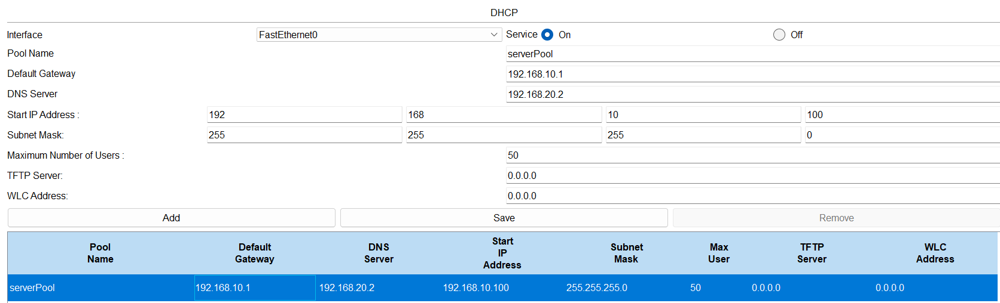
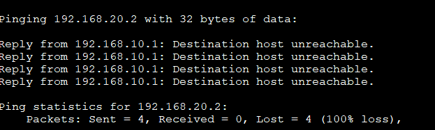
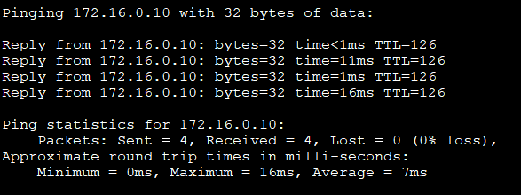

# 🛡️ Network Security & Traffic Analysis Lab (Cisco Packet Tracer)

## 📌 Overview

This project is a **simulated network security lab built in Cisco Packet Tracer** to demonstrate foundational networking, access control, and traffic analysis concepts.

The lab focuses on:

* Network segmentation using VLANs
* Inter-VLAN routing (Router-on-a-Stick)
* Traffic restriction using ACLs
* Basic switch security controls
* Packet-level traffic observation
* Centralized logging using Syslog

---

## 🧱 Network Design

The network consists of two segmented VLANs:

* **VLAN 10 (HR)**
* **VLAN 20 (IT)**

A router is used to perform inter-VLAN routing, and internal services are simulated within the network.

---

## ⚙️ Configuration & Implementation

### Networking

* Configured VLAN segmentation (VLAN 10 and VLAN 20)
* Implemented Router-on-a-Stick for inter-VLAN routing
* Enabled NAT for internal-to-external communication simulation

### Core Services

* Configured DHCP services; static IP addressing was used for endpoint validation due to simulation constraints
* Configured DNS for hostname resolution

### Security Controls

* Applied Access Control Lists (ACLs) to restrict inter-VLAN communication
* Implemented Port Security on switch interfaces
* Enabled DHCP Snooping to prevent rogue DHCP activity

### Logging & Monitoring

* Configured a Syslog server within Packet Tracer
* Enabled router logging to capture network events

---

## 📡 Traffic Analysis (Simulation Mode)

Packet Tracer Simulation Mode was used to analyze network behavior.

### ARP Analysis

* Observed ARP request and reply process
* Validated Layer 2 address resolution

### DHCP Analysis (DORA Process)

* Simulated DHCP process and analyzed message flow in Packet Tracer simulation mode
* Analyzed DHCP workflow conceptually; static addressing was used during testing due to simulation limitations

### DNS Analysis

* Observed DNS query and response behavior
* Validated hostname resolution

### ICMP Analysis

* Tested allowed ICMP traffic within VLAN
* Verified blocked ICMP traffic using ACL rules

---

## 🧠 Key Learning Outcomes

* Understanding of VLAN-based network segmentation
* Practical implementation of inter-VLAN routing
* Application of ACLs for traffic control
* Exposure to switch-level security features
* Ability to interpret packet-level network behavior
* Basic experience with centralized logging (Syslog)

---

## 📂 Project Structure

```
Network-Security-Lab
 ┣ README.md
 ┣ enterprise-network-security-lab.pkt

 ┣ topology
 ┃ ┗ topology.png

 ┣ captures
 ┃ ┣ basic
 ┃ ┃ ┣ vlan_config.png
 ┃ ┃ ┣ router_subinterfaces.png
 ┃ ┃ ┗ inter_vlan_connectivity_proof.png
 ┃ ┃
 ┃ ┣ dhcp
 ┃ ┃ ┣ dhcp_working.png
 ┃ ┃ ┣ pc_ip_config.png
 ┃ ┃
 ┃ ┣ acl
 ┃ ┃ ┣ acl_block_test.png
 ┃ ┃ ┣ acl_allow_test.png
 ┃ ┃ ┗ acl_hits.png
 ┃ ┃
 ┃ ┣ security
 ┃ ┃ ┣ dhcp_snooping.png
 ┃ ┃ ┣ port_security.png
 ┃ ┃ ┗ port_security_detail.png
 ┃ ┃
 ┃ ┣ routing_nat
 ┃ ┃ ┣ ospf_router1.png
 ┃ ┃ ┣ ospf_router2.png
 ┃ ┃ ┗ external_ping.png
 ┃ ┃
 ┃ ┗ packet_tracer
 ┃   ┣ arp_request_reply.png
 ┃   ┣ dns_query.png
 ┃   ┣ icmp_allowed.png
 ┃   ┗ icmp_blocked.png

 ┣ logs
 ┃ ┗ syslog_logs.png

 ┗ video
   ┗ enterprise-network-security-lab-demo.mp4
```

---

## 🎥 Demo Walkthrough (3 min)

What you're seeing in this demo:

1. Topology Overview  
   → VLAN-based segmented network with Router-on-a-Stick and centralized logging  

2. Allowed Traffic  
   → Communication within permitted network segments  

3. Blocked Traffic  
   → ACL enforcement blocking unauthorized ICMP traffic  

4. Packet Flow (Simulation Mode)  
   → ARP, ICMP behavior across the network  

5. Logging & Monitoring  
   → Syslog server capturing network events such as router config  

▶️ Watch Demo:  
[Watch Demo](./video/enterprise-network-security-lab-demo.mp4)

---

## 📸 Key Validation Screens

### DHCP Assignment


### ACL Enforcement


### Routing / External Connectivity


---

## 🎯 Notes

* This project is a **simulation-based lab**, not a production environment
* Packet Tracer Simulation Mode was used instead of real packet capture tools
* Syslog functionality is limited to simulation capabilities within Packet Tracer
* Some behaviors (e.g., detailed ACL logging) are limited by Packet Tracer simulation capabilities.

---
